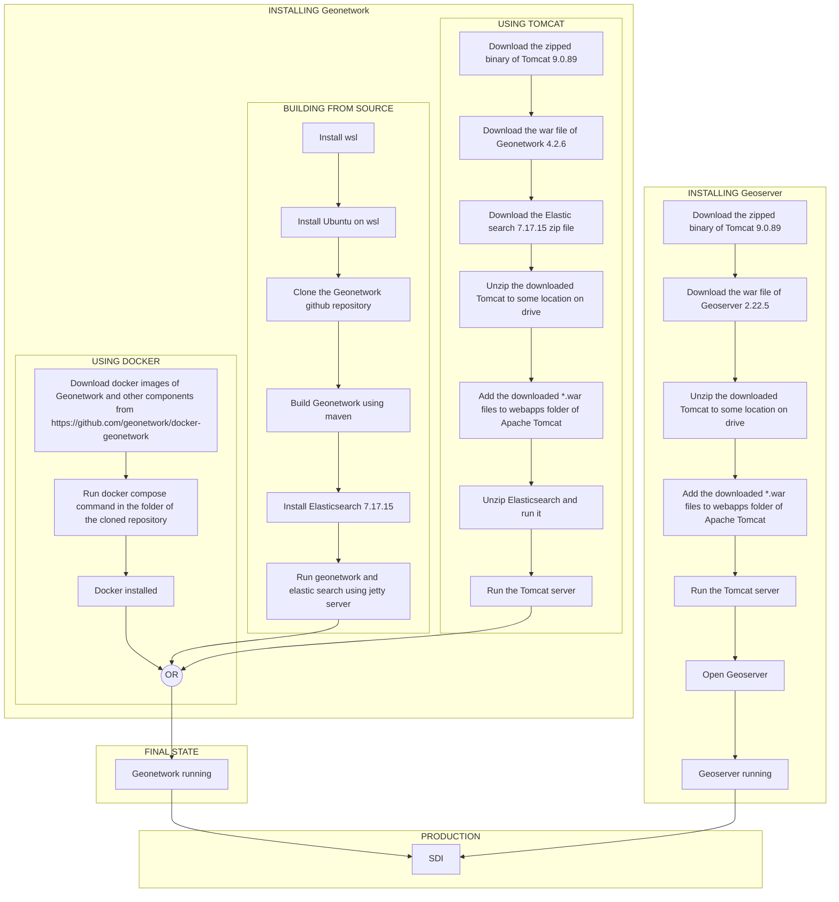

```mermaid
graph TD
subgraph FINAL STATE
d["Geonetwork running"]
end

subgraph INSTALLING Geonetwork

subgraph USING DOCKER
a["Download docker images of Geonetwork and other components from https://github.com/geonetwork/docker-geonetwork"] --> b
b["Run docker compose command in the folder of the cloned repository"] --> c
c["Docker installed"] --> or
end

subgraph BUILDING FROM SOURCE
e["Install wsl"] --> f
f["Install Ubuntu on wsl"] --> g
g["Clone the Geonetwork github repository"] --> h
h["Build Geonetwork using maven"] --> i
i["Install Elasticsearch 7.17.15"] --> j
j["Run geonetwork and elastic search using jetty server"] --> or
end

subgraph USING TOMCAT
k["Download the zipped binary of Tomcat 9.0.89"] --> l
l["Download the war file of Geonetwork 4.2.6"] --> m
m["Download the Elastic search 7.17.15 zip file"] --> n
n["Unzip the downloaded Tomcat to some location on drive"] --> o
o["Add the downloaded *.war files to webapps folder of Apache Tomcat"] --> p
p["Unzip Elasticsearch and run it"] --> q
q["Run the Tomcat server"] --> or
end

end

subgraph INSTALLING Geoserver

r["Download the zipped binary of Tomcat 9.0.89"] --> s
s["Download the war file of Geoserver 2.22.5"] --> t
t["Unzip the downloaded Tomcat to some location on drive"] --> u
u["Add the downloaded *.war files to webapps folder of Apache Tomcat"] --> v
v["Run the Tomcat server"] --> w
w["Open Geoserver"] --> xr["Geoserver running"]
end

subgraph PRODUCTION
d --> z["SDI"]
xr --> z
end

or(("OR")) --> d
```